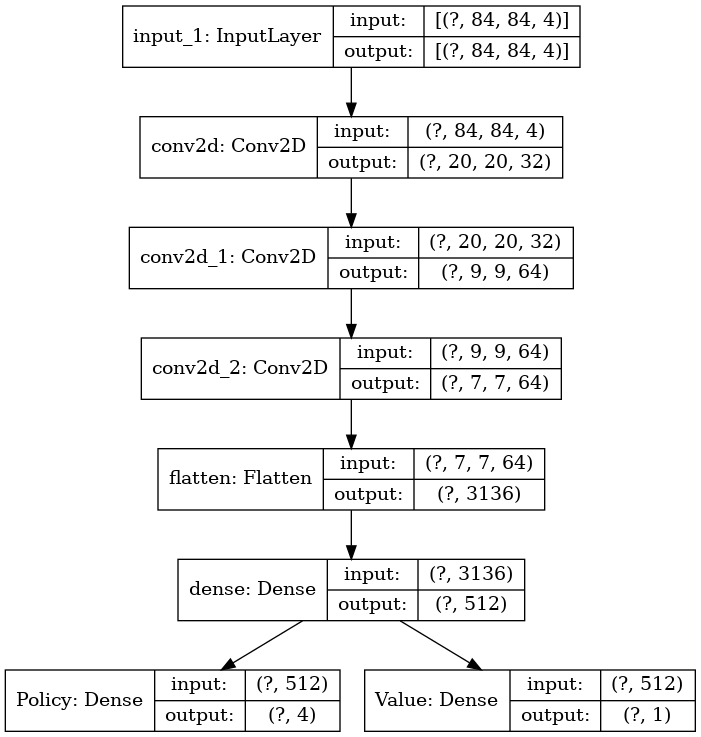

# 2022 딥강화학습 텀프로젝트

# 1. 사용 모델

## A3C

### 학습을 진행한 환경 (Atari)

- Pong
- SpaceInvaders
- KungFuMaster
- MsPacman
- Kangaroo

## 1.2 네트워크 구성

## 1.3 하이퍼파라미터

- 할인률($\gamma$) = 0.99
- 업데이트 타임 스텝 = 20
- 프로세스 수 = 16

# 2. input관련 처리(state정보 혹은 이미지 프로세싱 등) 

## 2.1 이미지 프로세싱

1. RGB to Gray 
    - 연산량을 줄이기 위해 RGB 프레임을 Gray 프레임으로 변경한다.

2. (84, 84)로 이미지 다운 샘플링

3. 4 프레임을 쌓아서 하나의 입력으로 변환

# 3. action 설정

## 4. 스코어 비교그래프
